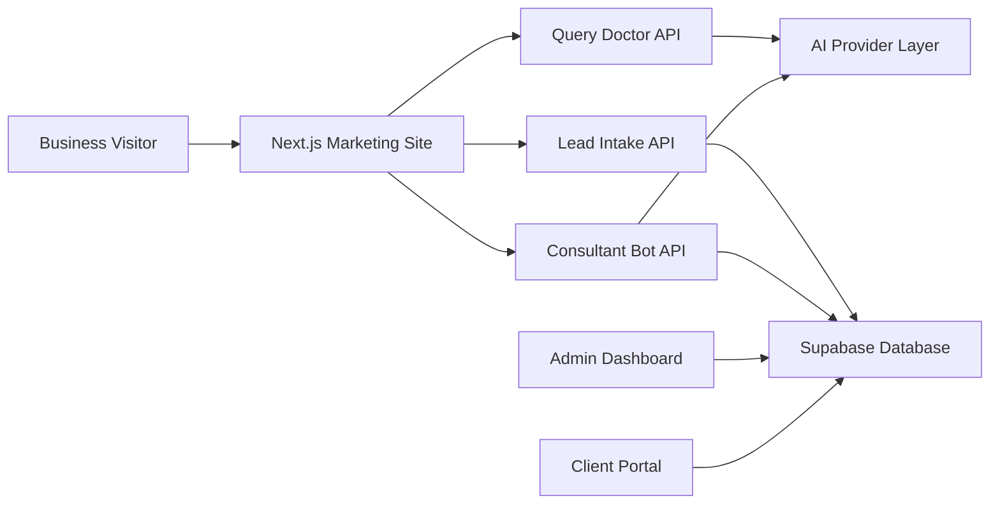

# AI Nexus Consulting

AI Nexus Consulting is a portfolio-grade AI automation platform concept for South African small businesses. It combines a public marketing site, AI workflow demos, a lead intake flow, Supabase-backed admin/client portal foundations, and responsible AI positioning around POPIA-aware automation.

This public version intentionally excludes private customer data, API keys, production credentials, and real outreach lists.

## What This Project Demonstrates

- Next.js App Router product application
- AI workflow APIs using the Vercel AI SDK and Google models
- Query Doctor: prompt/SQL improvement workflow
- Consultant bot foundation with usage logging
- Supabase schema for leads, settings, knowledge base, client portal records, and documents
- Admin dashboard concept for model settings, lead review, and client setup
- POPIA-first content strategy for local AI consulting

## Architecture



## Tech Stack

- Next.js 16
- React 19
- TypeScript
- Tailwind CSS 4
- Supabase Auth, Database, Storage
- Vercel AI SDK
- Google Generative AI
- Upstash Redis dependency for rate-limit capable workflows

## Local Setup

```bash
npm install
cp .env.example .env.local
npm run dev
```

Required environment variables are documented in [.env.example](.env.example).

## Security Notes

- Service-role Supabase keys must stay server-only.
- `.env.local` and other real env files are ignored by git.
- Public lead submission is allowed through RLS; lead listing is not exposed through the public leads API.
- Demo admin access is disabled unless `NEXT_PUBLIC_DEMO_ADMIN_CODE` is explicitly set.
- Production admin access should use Supabase Auth and role-based access control.

## Portfolio Status

This repository is suitable for recruiters and technical interviewers to inspect the architecture and implementation direction. Production client workflows, private outreach data, and credentials remain private.
