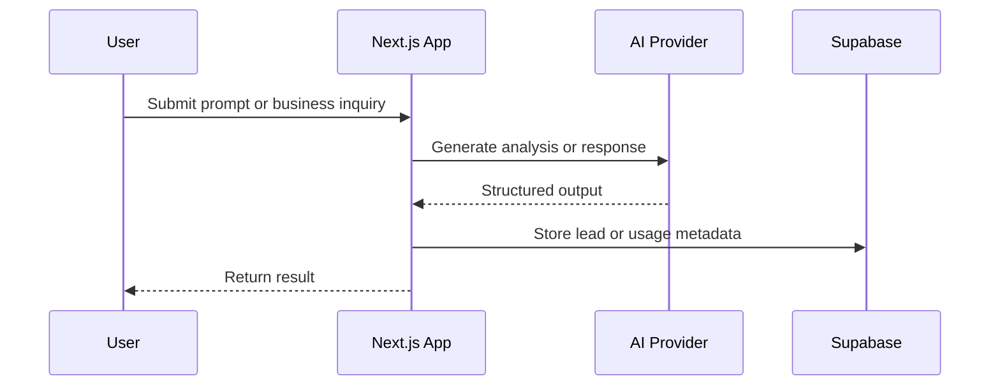

# Architecture

AI Nexus Consulting is organized as a practical AI automation platform rather than a single chatbot demo.

## Application Layers

| Layer | Responsibility |
| --- | --- |
| Public site | Positioning, services, insights, lead capture |
| AI workflow APIs | Query Doctor and consultant bot endpoints |
| Provider layer | Model configuration and fallback behavior |
| Supabase data layer | Leads, usage logs, model settings, knowledge base, client portal |
| Admin dashboard | Operational review, model settings, client onboarding concept |
| Client portal | Authenticated client access and document delivery foundation |

## Data Flow

## Responsible AI Shape

The repo is built around a human-in-the-loop consulting model:

- Improve user prompts before automation runs.
- Store only operational metadata needed for review.
- Keep customer documents behind authenticated portal flows.
- Keep service-role database operations server-side.
- Treat POPIA and data-minimization as product requirements, not afterthoughts.
